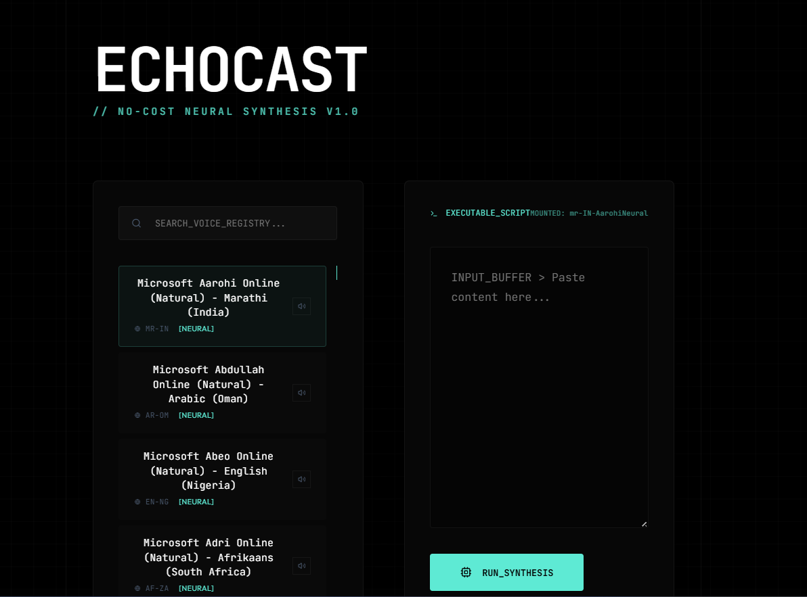

# EchoCast 🎙️

EchoCast is a premium Text-to-Speech (TTS) application powered by Microsoft Edge's high-quality TTS engine. It features a modern, glassmorphic "Midnight Studio" interface and supports a wide range of voices and regional accents.

## ✨ Interface Preview



## 🚀 Features

- **High-Fidelity Audio**: Powered by Edge-TTS for natural-sounding speech.
- **Midnight Studio UI**: A sleek, dark-themed interface with glassmorphic effects.
- **Voice Selection**: Comprehensive list of voices with regional metadata and live sampling.
- **Real-time Processing**: Fast text-to-speech conversion with streaming responses.

## 🛠️ Tech Stack

- **Frontend**: React, Vite, Vanilla CSS.
- **Backend**: FastAPI (Python), Edge-TTS.

## 📥 Installation & Setup

### Prerequisites
- Python 3.9+
- Node.js & npm

### Backend Setup
1. Navigate to the `backend` directory:
   ```bash
   cd backend
   ```
2. Create and activate a virtual environment:
   ```bash
   python -m venv venv
   # On Windows:
   venv\Scripts\activate
   # On macOS/Linux:
   source venv/bin/activate
   ```
3. Install dependencies:
   ```bash
   pip install -r requirements.txt
   ```
4. Run the server:
   ```bash
   python main.py
   ```

### Frontend Setup
1. Navigate to the `frontend` directory:
   ```bash
   cd frontend
   ```
2. Install dependencies:
   ```bash
   npm install
   ```
3. Start the development server:
   ```bash
   npm run dev
   ```

## 📄 License
MIT
